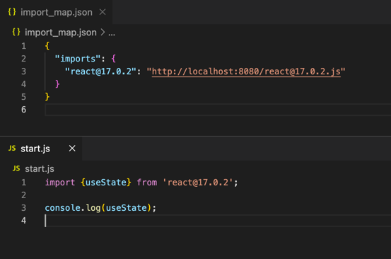

# UImport

> Convert NPM packages (ex: react, vue, d3, ...) into fresh ESM, locally!

Import them in any ESM environment (browser, Node.js v14+, Deno, etc).

```javascript
import {useState} from 'react';
```

# How it works

```bash
npm install -g uimport
```

* UImport does not install the packages, but instead requires the packages to be installed in the working directory
  before calling it.

## Bundles

We define as `bundles` to the ES modules generated from the packages or the subpaths of the packages.

By instance
> `react` is a package that does not define subpaths, so react is a bundle.
>
> `svelte` is a package that does define subpaths, so `svelte/internal` or `svelte/store` are bundles of the same svelte package.

## Subpaths

UImport generates the packages considering the subpaths specified in the `.exports` property of the package.json.
Specifying the `.exports` property of the package.json is a best practice for separating the package into independently
units of code.

```javascript
// The following two EM modules belong to the same package (svelte)
import 'svelte/internal';
import 'svelte/store';
````

Unfortunately, there is a wide variety of packages that do not follow such specific criteria. Many of them were created
before the .exports property of package.json existed, and were generally intended to work with bundlers like webpack,
and not to be consumed directly from a browser or deno.

When uimport generates a bundle, and finds a dependency on a subpath of a package that does not specify the .exports
property, then uimport will not split the code, but rather include the code in the requested bundle.

## Local server

Your application can consume the bundles through a local server provided by uimport, by running:

```bash
uimport server --port=8080 --cwd=working_directory
```

### Resource URLs

#### Load the package at the version specified in the package.json.

```javascript
import 'http://localhost:port/package_name';
````

#### Load the exact version of the package

We recommend importing packages by specifying their version.

```javascript
import 'http://localhost:port/package_name@version'
```

.

Although an application directly uses a specific version of a package, each of them in turn has its own dependencies
with versions that can be different.

UImport generates by default the dependencies of the packages according to the version that each of them requires. This
way, if your app specified a dependency (ex: dep_a@2.0.0) in the package.json, but then another dependency requires
dep_a@1.0.0, uimport will be able to generate both.

## API

UImport will look into the node_modules folder to find the package to be bundled. You can optionally specify the current
working directory where node_modules resides.

```javascript
const uimport = require('uimport');
const bundle = 'react';
const {code, errors, warnings, dependencies} = await uimport(bundle);
```

```javascript
// mode can be 'esm' or 'amd'
const {code, errors, warnings, dependencies} = await uimport(bundle, mode, specs);
```

* specs:

```typescript
interface specs {
    cwd?: string,   // The working directory where the local NPM modules are installed
    temp?: string,  // A required folder to save temporary files. Default: join(cwd, '.uimport/temp')
    cache?: string, // Bundles are saved in cache. Default: join(cwd, '.uimport/cache');
    dependencies?: boolean // Build the dependencies of the bundle
}
```

```typescript
interface output {
    code: string,
    errors?: string[],
    warnings?: string[],
    dependencies?: string[]
}
```

# Pre-generated bundles and static resources

NPM packages were born essentially in order to host packages to be consumed by nodejs applications. Its use has spread
and currently the packages hosted on NPM can be consumed by environments such as the Browser or Deno thanks to CDNs such
as skypack, jsdelivr, jspm, unpkg.

However, package compatibility is dependent on a process of packaging and converting to ES modules. In the future this
could change, simply if the authors specify in the package.json the input to the pre-built ES modules.

UImport currently skips the bundle generation process if it finds the uimport property in the package.json.

## UImport property

Package.json example:

```json5
{
  "name": "your-package",
  "uimport": {
    "bundles": {
      "./store": "./store/index.js"
    }
  }
}
```

```typescript
interface uimport {
    bundles: Record<string, string>,
    assets: Record<string, string>
}
```

Where:

* `.bundles` Specifies the ES module to be returned for each entry point.
* `.assets` Similar to the .bundles property, but defining general purpose files such as images.

# About uimport

UImport was created and it is being maintained by the [BeyondJS](https://www.npmjs.com/package/beyond) team. BeyondJS is
an open source fullstack universal typescript framework, based on a modular project creation design where each project
can be published (or not) in NPM packages that can in turn be universally consumed by any ESM environment.

## Motivation

We have observed that CDNs like skypack, jsdelivr, jspm or unpkg, as well as frameworks like vite are implementing their
own NPM package packaging strategy. We believe that there should be an open source solution that should be easy to use
and embraced by the developer community.

We have seen that the results of packages generated by CDNs in multiple cases vary. In some cases, some packages
directly return an error on one CDN, and the processed code on another CDN.

CDNs are very important in our opinion. They can for example speed up the web thanks to the cross site cache. More and
more client libraries emerge (such as vue, svelte, react, etc), they are widely used, but generally hosted individually
in each project.

# Feedback and collaboration

* If you know of an alternative solution to `uimport`, please let us know.
* If `uimport` is useful to you, maybe you can collaborate with us.

> [hello@beyondjs.com](mailto:hello@beyondjs.com). 
